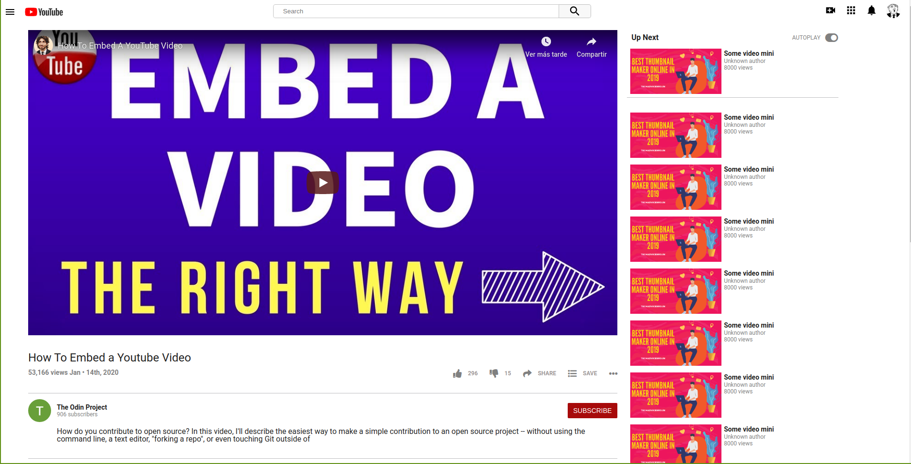

# YoutubeVideo

This is one of the first project I work on like part of Microverse program, the puropose of this project is abotu making a basic copy of youtube site, 

# Embedding Images and Video

> This project tries to make a clone from youtube layouts using flexbox.

## Built With

- CSS and HTML
- Flexbox}
- Media queries
- fontawesome

## Live Demo

[Live Demo Link](https://wizardly-raman-7eed13.netlify.com)

## Getting Started

**This is a static page and was made using  CSS & HTML, you don't need .**
**anything to start up this page, is already published in a public repository so you can check the final result. For a better understanding of the code read about FlexBox.**

## Authors

👤 **Xóchitl Selene Flores Pérez**

- Github: [@enelesmai](https://github.com/enelesmai)
- Twitter: [@enelesmai](https://twitter.com/enelesmai)
- Linkedin: [xochitlselene](https://linkedin.com/in/xochitlselene)

👤 **Ruben Paz Chuspe**

- Github: [@rubenpazch](https://github.com/rubenpazch)
- Linkedin: [rubenpch](https://www.linkedin.com/in/rubenpch/)

## 🤝 Contributing

Contributions, issues and feature requests are welcome!

Feel free to check the (https://github.com/rubenpazch/youtubevideo/issues).

## Show your support

Give a ⭐️ if you like this project!

## Acknowledgments

- Hat tip to anyone whose code was used
- Inspiration
- etc

## 📝 License

This project is [MIT](lic.url) licensed.
